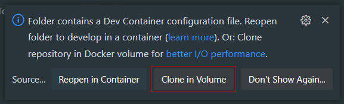
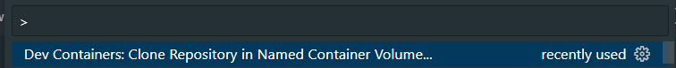

# AVR-PX4-Firmware

[](https://github.com/bellflight/AVR-PX4-Firmware/actions/workflows/build.yml)

This repository produces builds of PX4 with the patches required for Bell AVR HIL GPS,
along with modified versions of [Pymavlink](https://github.com/ardupilot/pymavlink).

## Usage

*This repository needs to be used inside of a DevContainer.*

When using VS Code, accept the "Clone in Volume" Devcontainer prompt.
For Windows users, this will signficantly improve disk I/O and compile times.



Additionally, you can also select the same command from the command palette:



Once inside the Devcontainer, you can now run the build script. All files
generated by the build script will go into `dist/`.

```bash
$ python build.py --help
usage: build.py [-h] [--version VERSION] [--pymavlink] [--px4] [--wireshark]
                [--targets TARGETS [TARGETS ...]]

Generate a PX4/Pymavlink build

optional arguments:
  -h, --help            show this help message and exit
  --version VERSION
  --pymavlink           Build Pymavlink package
  --px4                 Build PX4 firmware
  --wireshark           Build Wireshark Lua plugins
  --targets TARGETS [TARGETS ...]
```

## Files

- `.px4-version`: PX4 version to build against, in the style of `.python-version` or `.node-version`.
- `AVR.params`: PX4 parameters to unconditionally trust the HIL GPS.
- `bell.xml`: New MAVLink message
- `patches/`: PX4 and pymavlink patches to monkey patch the code.
